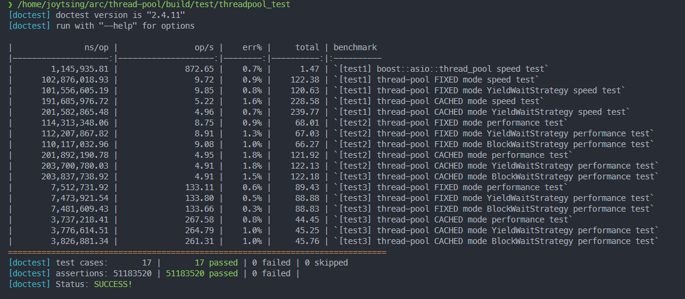
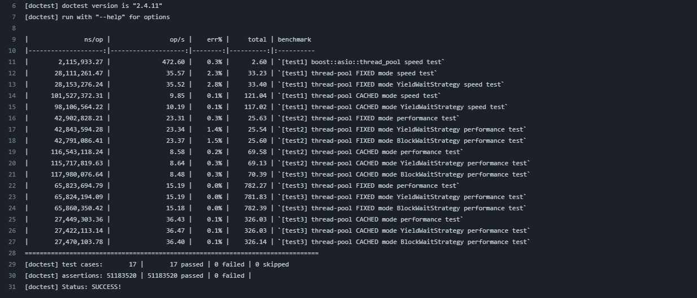

## C++ 20 ThreadPool

基于C++20标准的线程池，需要编译器支持std20标准(用到了20的库)。第三方库使用了doctest和nanobench进行测试，使用backward-cpp进行错误分析和追踪，此外还与boost库进行了对比测试。

```
  _______  _                            _  _____               _ 
 |__   __|| |                          | ||  __ \             | |
    | |   | |__   _ __  ___   __ _   __| || |__) |___    ___  | |
    | |   | '_ \ | '__|/ _ \ / _` | / _` ||  ___// _ \  / _ \ | |
    | |   | | | || |  |  __/| (_| || (_| || |   | (_) || (_) || |
    |_|   |_| |_||_|   \___| \__,_| \__,_||_|    \___/  \___/ |_|

```
## Getting the Source

> git clone --recursive https://github.com/JoyTsing/thread-pool

## Building

本项目基于CMake，在Ubuntu 22.04 LTS 环境下开发，gcc版本最好使用13及以上。

## Build for POSIX
Quick start:

> ./build.sh

## Features

* 实现基于 C++20 `std::source_location`和`std::fmt`的head-only日志库
* 实现 `std::function`
* 实现 `std::optional`
* 实现可更换等待策略的无锁队列
* 可拓展的线程池本体
* perf分析性能
* 通过git action进行CI
* ...

## Bench

本地wsl2上的bench:



git actions上的bench:

